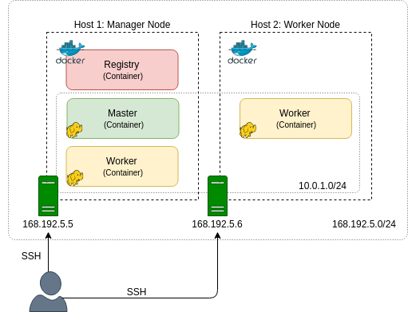
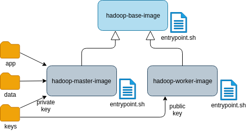
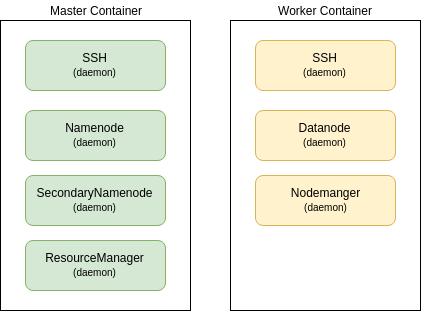

# Hadoop on Docker. Part 1: Introduction

Sergei Yu. Papulin (papulin.study@yandex.ru)

## Activities

- building a base image for Hadoop distribution ([part 2](hadoop_docker_part_2.md))
- building master and worker images ([part 3](hadoop_docker_part_3.md))
- running a Hadoop cluster on a single host ([part 4](hadoop_docker_part_4.md))
- deploying a Hadoop cluster on multiple hosts using Docker Swarm mode ([part 5](hadoop_docker_part_5.md))
- using a compose file to deploy Docker Swarm ([part 6](hadoop_docker_part_6.md))
- using Python Docker SDK to deploy Docker Swarm ([part 7](hadoop_docker_part_7.md))

## Architecture

<i>Figure 1. Hadoop Cluster Architecture</i>

<i>Figure 2. Hadoop Images</i>

<i>Figure 3. Hadoop Containers</i>

## Drawbacks

The most obvious drawbacks of this architecture are

- multiple daemons running in a single container;
- all master daemons reside in a single container on the same host;
- `Namenode` and `SecondaryNamenode` share a host;
- no HA for `Namenode` and `ResourceManager`.
