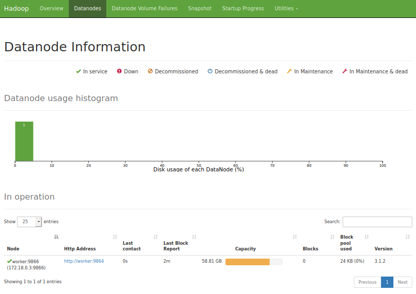

# Hadoop on Docker. Part 3: Building Hadoop Master and Worker Images

Sergei Yu. Papulin (papulin.study@yandex.ru)

## Contents

- Building Hadoop Master and Worker Images
  - Master Image
  - Worker Image
- Cleaning Up
- References

## Previous steps

- [Part 1: Introduction](hadoop_docker_part_1.md)
- [Part 2: Building Base Hadoop Image](hadoop_docker_part_2.md)

## Building Hadoop Master and Worker Images

Let's choose the debian image as the main one for our Hadoop cluster. 

Go to the working directory:

`cd $YOUR_PATH/projects/docker/hadoop/base/`

And create the base image using `jdk-debian.Dockerfile`:

`docker build -t hadoop-base-image -f jdk-debian.Dockerfile .`

```
...
Successfully built c34259062ed5
Successfully tagged hadoop-base-image:latest
```

`docker image ls *base*`

```
REPOSITORY          TAG                 IMAGE ID            CREATED              SIZE
hadoop-base-image   latest              c34259062ed5        About a minute ago   1.05GB
```


### Master Image

#### Dockerfile

```dockerfile
FROM hadoop-base-image

LABEL maintainer="Sergei Papulin <papulin.study@yandex.ru>"

USER root

# Copy a private key
COPY --chown=bigdata:bigdata ./keys/id_rsa .ssh/

# Copy the entrypoint script
COPY ./master/entrypoint.sh /usr/local/bin/

RUN chmod 400 .ssh/id_rsa && \
    chmod 755 /usr/local/bin/entrypoint.sh 

USER bigdata

# Format Namenode
RUN hdfs namenode -format -force

ENTRYPOINT ["sh", "/usr/local/bin/entrypoint.sh"]
```

#### Entrypoint

```bash
#!/bin/bash

echo "Start SSH service"
sudo service ssh start

echo "Start Hadoop daemons"
hdfs --daemon start namenode
hdfs --daemon start secondarynamenode
yarn --daemon start resourcemanager
mapred --daemon start historyserver

if [ -d "$HOME/data" ]; then
    # Wait for binding datanodes
    sleep 5
    echo "Copy files to HDFS"
    hdfs dfs -copyFromLocal /home/bigdata/data /
fi

echo "The entrypoint script is completed"

tail -f /dev/null
```

#### Building Image

Change your current directory to one where the Dockerfile is:

`cd $YOUR_PATH/projects/docker/hadoop`

Build a Hadoop image by running the following command:

`docker build -t hadoop-master-image -f ./master/Dockerfile .`

```
...
Successfully built 7da9e445fd83
Successfully tagged hadoop-master-image:latest
```

`docker run --name master -it -d -p 9870:9870 -h master hadoop-master-image`

```
9c11987365ba0839657d722c2104832c21f2f8b082261aa0734a7ee4d4a145a3
```

`docker container logs master`

```
Start SSH service
[ ok ] Starting OpenBSD Secure Shell server: sshd.
Start Hadoop daemons
The entrypoint script is completed
```

`docker exec master bash hdfs dfsadmin -report`

```
Configured Capacity: 0 (0 B)
Present Capacity: 0 (0 B)
DFS Remaining: 0 (0 B)
DFS Used: 0 (0 B)
DFS Used%: 0.00%
Replicated Blocks:
        Under replicated blocks: 0
        Blocks with corrupt replicas: 0
        Missing blocks: 0
        Missing blocks (with replication factor 1): 0
        Low redundancy blocks with highest priority to recover: 0
        Pending deletion blocks: 0
Erasure Coded Block Groups: 
        Low redundancy block groups: 0
        Block groups with corrupt internal blocks: 0
        Missing block groups: 0
        Low redundancy blocks with highest priority to recover: 0
        Pending deletion blocks: 0

-------------------------------------------------
```

`docker container rm -f  master`

```
master
```

### Worker Image

#### Dockerfile

```dockerfile
FROM hadoop-base-image

USER root

# Copy a public key
COPY --chown=bigdata:bigdata ./keys/id_rsa.pub .ssh/

# Copy the entrypoint script
COPY ./worker/entrypoint.sh /usr/local/bin/

RUN cat .ssh/id_rsa.pub >> .ssh/authorized_keys && \
    chmod 755 /usr/local/bin/entrypoint.sh 

USER bigdata

ENTRYPOINT ["sh", "/usr/local/bin/entrypoint.sh"]
```

#### Entrypoint

```bash
#!/bin/bash

echo "Start SSH service"
sudo service ssh start

echo "Start Hadoop daemons"
hdfs --daemon start datanode
yarn --daemon start nodemanager

tail -f /dev/null
```

#### Building Image

Change your current directory to one where the Dockerfile is:

`cd $YOUR_PATH/projects/docker/hadoop`

Build a Hadoop image by running the following command:

`docker build -t hadoop-worker-image -f ./worker/Dockerfile .`

```
...
Successfully built 7682b5b35f67
Successfully tagged hadoop-worker-image:latest
```

`docker run --name worker -it -d -h worker hadoop-worker-image`

```
0f7a13f4ceed915a327ae93b620817a0a9fd713723b3fbffb97c81e12702220d
```

`docker container logs worker`

```
Start SSH service
[ ok ] Starting OpenBSD Secure Shell server: sshd.
Start Hadoop daemons
WARNING: /home/bigdata/hadoop/logs does not exist. Creating.
```

`docker container rm -f  worker`

```
worker
```

### Master-Worker Connection

`docker network create hadoop-network`

```
17a541a2663dfc786b229369d8e4313971caa42ed8d901ba858d7d7f8c47fc86
```

`docker run --name master -it -d -h master -p 9870:9870 --network hadoop-network  hadoop-master-image`

```
c431747e9b3eb17a4376c12cdcfe39ddc7a89d46f9c5d8cd913a2923f73d63d4
```

`docker run --name worker -it -d -h worker --network hadoop-network  hadoop-worker-image`

```
52d44211b024058fe88f3c4e9affb6d60bc514d1dbc8f375ba8f6e39467ba8b7
```

`localhost:9870`


<center><i>Figure 1. Datanodes Tab</i></center>


`docker exec master bash hdfs dfsadmin -printTopology`

```
Rack: /default-rack
   172.18.0.3:9866 (worker.hadoop-network)
```

`docker exec master bash hdfs dfsadmin -report`

```
Configured Capacity: 63142932480 (58.81 GB)
Present Capacity: 10942218240 (10.19 GB)
DFS Remaining: 10942193664 (10.19 GB)
DFS Used: 24576 (24 KB)
DFS Used%: 0.00%
Replicated Blocks:
        Under replicated blocks: 0
        Blocks with corrupt replicas: 0
        Missing blocks: 0
        Missing blocks (with replication factor 1): 0
        Low redundancy blocks with highest priority to recover: 0
        Pending deletion blocks: 0
Erasure Coded Block Groups: 
        Low redundancy block groups: 0
        Block groups with corrupt internal blocks: 0
        Missing block groups: 0
        Low redundancy blocks with highest priority to recover: 0
        Pending deletion blocks: 0

-------------------------------------------------
Live datanodes (1):

Name: 172.18.0.3:9866 (worker.hadoop-network)
Hostname: worker
Decommission Status : Normal
Configured Capacity: 63142932480 (58.81 GB)
DFS Used: 24576 (24 KB)
Non DFS Used: 48962818048 (45.60 GB)
DFS Remaining: 10942193664 (10.19 GB)
DFS Used%: 0.00%
DFS Remaining%: 17.33%
Configured Cache Capacity: 0 (0 B)
Cache Used: 0 (0 B)
Cache Remaining: 0 (0 B)
Cache Used%: 100.00%
Cache Remaining%: 0.00%
Xceivers: 1
Last contact: Wed Dec 25 18:19:45 UTC 2019
Last Block Report: Wed Dec 25 18:18:25 UTC 2019
Num of Blocks: 0
```

## Cleaning up

`docker container stop master worker`

```
master
worker
```

`docker container rm master worker`

```
master
worker
```

`docker network rm hadoop-network`

```
hadoop-network
```

## References

```
TODO
```