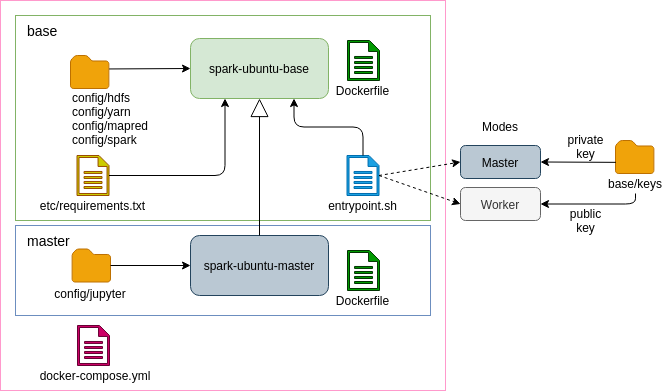
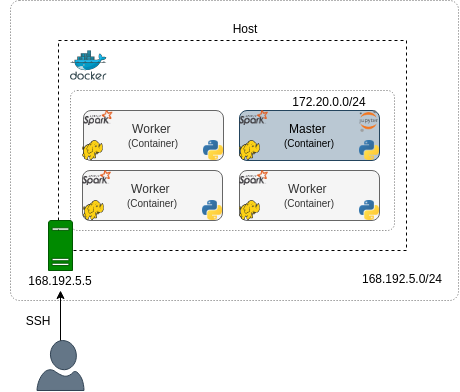
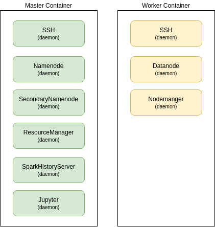

# Deploying Spark on YARN cluster using Docker

Sergei Yu. Papulin (papulin_bmstu@mail.ru)

## Contents

- [Architecture](#Architecture)
    - Containers
    - Images
    - Services
- [Installing Docker](#Installing-Docker)
- [Creating base image](#Creating-base-image)
    - Building base image
    - Running master and worker containers
    - Cleaning up
- [Extending base image](#Extending-base-image)
    - Building master image
    - Running master and worker containers
    - Cleaning up
- [Creating cluster using Docker Compose](#Creating-Docker-Compose)
- [Launching Spark application](#Launching-Spark-application)
    - Self-Contained Application
    - Interactive shell with Jupyter
- [References](#References)


## Architecture


### Images

<center>



<i>Figure 1. Images</i></center>


### Containers

<center>



<i>Figure 2. Containers</i></center>


### Services

<center>



<i>Figure 3. Daemons</i></center>

## Installing Docker

To install the Docker Engine, follow the steps from the official Docker site (here is the [link](https://docs.docker.com/install/linux/docker-ce/ubuntu/)) or look at this [guideline](howto_install_docker.md).
## Creating base image

The following software and packages should be installed on the base image:
1. `Ubuntu 16.04` (`Python 3.5`)
2. Common Utilities: `openssh-server`, `software-properties-common`, `sudo`, `nano` etc.
3. `Hadoop 3.1.2`
4. `Spark 2.4.7`
5. Python packages: `pip`, `numpy`, `pandas` etc.

Source code:
- Docker file for assembling the base image: [Dockerfile](../projects/docker/spark/base/Dockerfile)
- Starter script: [entrypoint.sh](../projects/docker/spark/base/scripts/entrypoint.sh)

### Building base image 

**Project structure**

The directory structure of the base image project:

```
base
├── config                  # configurations for Hadoop and Spark
│   ├── hdfs
│   │   ├── core-site.xml
│   │   ├── hadoop-env.sh
│   │   └── hdfs-site.xml
│   ├── mapreduce
│   │   └── mapred-site.xml
│   ├── spark
│   │   ├── spark-defaults.conf
│   │   └── spark-env.sh
│   └── yarn
│       ├── capacity-scheduler.xml
│       ├── yarn-env.sh
│       └── yarn-site.xml
├── Dockerfile              # assembling image
├── etc
│   └── requirements.txt    # python packages
├── keys
│   ├── id_rsa              # private key
│   └── id_rsa.pub          # public key
└── scripts
    └── entrypoint.sh       # starter script
```

**Dockerfile**

Docker file for assembling the base image: [Dockerfile](../projects/docker/spark/base/Dockerfile)

Three stages:
1. Downloading and extracting Hadoop (`hadoopBuilder`)
2. Downloading and extracting Spark (`sparkBuilder`)
3. Assembling instructions for the main part of the base image (`main`)
    1. Creating the `bigdata` user
    2. Copying Hadoop and Spark from previous stages
    3. Setting environment variables
    4. Installing system utilities/packages, JDK 8 and python pip
    5. Installing python packages using a `requirements` file
    6. Providing the `bigdata` user privilege to start a ssh service
    7. Copying configuration files and a starter script
    8. Setting the starter script as an entrypoint.


**Entrypoint**

Starter script: [entrypoint.sh](../projects/docker/spark/base/scripts/entrypoint.sh)

```bash
main()
{
    NODE_TYPE=$1
    shift

    echo "Command execution..."

    case $NODE_TYPE in
        "master") 
            init_master "$@"
            ;;
        "worker") 
            init_worker "$@"
            ;;
        *)
            echo "Error: Unsupported node type."
            exit 127
            ;;
    esac

    echo "The entrypoint script is completed."
    tail -f /dev/null
}
```

Command to execute:

`/bin/bash entrypoint.sh master|worker`

Master initialization:
1. Creating a private key file from a value of the environment variable (if needed)
2. Starting SSH service
3. Formatting HDFS (if needed)
4. Starting HDFS, YARN and Spark services

Worker initialization:
1. Creating a public key file from a value of the environment variable (if needed)
2. Starting SSH service
3. Starting HDFS (`datanode`) and YARN (`nodemanager`) services

**Building base image**

Directory for the spark docker project:

`cd projects/docker/spark/`


To build a Spark base image, run the following command:

`docker build -t spark-ubuntu-base -f base/Dockerfile base`

Display a list of images:

`docker image ls`


### Running master and worker containers

**Network**

Create a network:

`docker network create spark-network`

**Master**

Run a master container:

```
docker run -itd \
    --name master \
    --publish 9870:9870 -p 8088:8088 -p 18080:18080 \
    --env SSH_PRIVATE_KEY="$(cat $(pwd)/base/keys/id_rsa)" \
    --hostname master \
    --network spark-network \
    spark-ubuntu-base master
```

Display a list of running containers:

`docker container ls`

Check logs for the master container:

`docker container logs master`

You can print out all java processes by the following command:

`docker exec -it master jps`

Or you can explore the container using bash:

`docker exec -it master bash`

Now open your browser and open HDFS and YARN dashboards:

`localhost:9870` and `localhost:8088`

**Worker**

Next step is to run a worker container. Use the following command to run it:

```
docker run -itd \
    --name worker \
    --env SSH_PUBLIC_KEY="$(cat $(pwd)/base/keys/id_rsa.pub)" \
    --hostname worker \
    --network spark-network \
    spark-ubuntu-base worker
```

Display a list of running containers:

`docker container ls`

Check logs for the master container:

`docker container logs worker`

You can print out all java processes by the following command:

`docker exec -it worker jps`

In the dashboards that you opened earlier, you should notice that a new worker node has appeared.

### Cleaning up

Let's stop and remove containers:

`docker stop master worker && docker rm master worker`

## Extending base image

Source code:
- Docker file for assembling the master image: [Dockerfile](../projects/docker/spark/master/Dockerfile)

### Building master image


**Project structure**

The directory structure of the master image project:

```
master
├── config
│   └── jupyter
│       ├── jupyter_notebook_config.py  # jupyter configuration
│       └── pyspark-kernel.json         # add pyspark kernel
└── Dockerfile
```

**Dockerfile**

Docker file for assembling the master image: [Dockerfile](../projects/docker/spark/master/Dockerfile)

Instructions:
1. Installing a jupyter notebook server
2. Copying jupyter configurations
3. Running the starter script (the same script as before)

### Running master and worker containers

Run a master container using the new master image:

```
docker run -itd \
    --name master \
    --publish 9870:9870 -p 8088:8088 -p 18080:18080 -p 9999:9999 \
    --env SSH_PRIVATE_KEY="$(cat $(pwd)/base/keys/id_rsa)" \
    --hostname master \
    --network spark-network \
    spark-ubuntu-master master
```

And launch a worker container:

```
docker run -itd \
    --name worker \
    --env SSH_PUBLIC_KEY="$(cat $(pwd)/base/keys/id_rsa.pub)" \
    --hostname worker \
    --network spark-network \
    spark-ubuntu-base worker
```

If everything is working properly, start the jupyter server:

`docker exec -itd master jupyter notebook --config .jupyter/jupyter_notebook_config.py`

Now go to `localhost:9999` and you will see a jupyter start page. Enter a password: `bigdata`

Create a new notebook by selecting the `PySpark` kernel, paste the code below and run it:

```python
import pyspark

conf = pyspark.SparkConf() \
        .setAppName("testApp") \
        .set("spark.submit.deployMode", "client") \
        .setMaster("yarn")

sc = pyspark.SparkContext(conf=conf)

data = [1, 2, 3, 4, 5]
data_rdd = sc.parallelize(data)
data_rdd.collect()

sc.stop()
```

You can split the code into multiple cells if you wish.

Note: Spark will run the application on YARN by default as the `spark-defaults.conf` configuration file that we included to the base image contains the following line:

```
...
spark.master		yarn 
...
```

To see current progress and history, open the HDFS (`9870`), YARN (`8088`) or Spark History Server (`18080`) dashboards.

If you stop the containers by the stop `command`, you will preserve changes and will be able to `start` them later. 

`docker stop master worker`

### Cleaning up

Stop and remove the containers:

`docker stop master worker && docker rm master worker`

Note: If you stop the containers by the `stop` command, you will preserve changes and will be able to `start` them later. But if you remove them and execute the `run` command, you will lose all states. So, in this case you should use persistent volumes.

Remove the network:

`docker network rm spark-network`

## Creating cluster using Docker Compose

Project structure:
```
├── base                # base image directory
├── docker-compose.yml  # definition of multi-container environment
└── master              # master image directory
```

Docker-compose file for deploying multi-container environment: [docker-compose.yml](../projects/docker/spark/docker-compose.yml)
```yaml
version: "3.7"

services:
  master:
    image: spark-ubuntu-master
    # build:          # use this option if an image doesn't exist
    #   context: .
    #   dockerfile: ./master/Dockerfile
    command: master   # argument for entrypoint script
    hostname: master
    environment: 
      - SSH_PRIVATE_KEY=${SSH_PRIVATE_KEY}
    ports:
      - "9870:9870"
      - "8088:8088"
      - "18080:18080"
      - "9999:9999"
    container_name: master
    volumes: 
      - ./data:/home/bigdata/data
      - ./app:/home/bigdata/app
  worker:
    image: spark-ubuntu-base
    # build:
    #   context: .
    #   dockerfile: ./base/Dockerfile
    command: worker
    environment: 
      - SSH_PUBLIC_KEY=${SSH_PUBLIC_KEY}
```

To build (if needed) and run all services from the compose file, execute the following command:

```
SSH_PRIVATE_KEY="$(cat $(pwd)/base/keys/id_rsa)" \
SSH_PUBLIC_KEY="$(cat $(pwd)/base/keys/id_rsa.pub)" \
docker-compose up -d --scale worker=3
```

The `scale` option is used to run 3 workers.

Check whether everything is working correctly and there are no errors.

Next, start the jupyter server:

`docker exec -itd master jupyter notebook --config .jupyter/jupyter_notebook_config.py`

Now, you have a Spark on YARN cluster with the single master and 3 workers.

To stop the cluster, run the command below:

`docker-compose stop`

You can stop one or several services as well:

`docker-compose stop [options] [SERVICE...]`

To restart the services, use the `start` command:

`docker-compose start` or add `[SERVICE...]` to specify services

To stop and remove containers and related docker objects (e.g. networks), execute the following command:

`docker-compose down`


## Launching Spark application

### Self-Contained Application

```
TODO
```

### Interactive shell with Jupyter

```
TODO
```

## References

- [Best practices for writing Dockerfiles](https://docs.docker.com/develop/develop-images/dockerfile_best-practices/)
- [How to get IP address of running docker container from host using inspect command?](https://thispointer.com/how-to-get-ip-address-of-running-docker-container-from-host-using-inspect-command/)